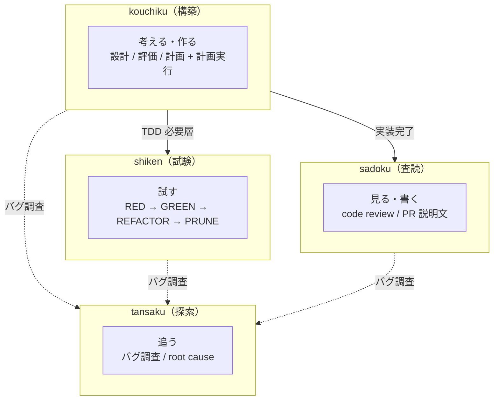
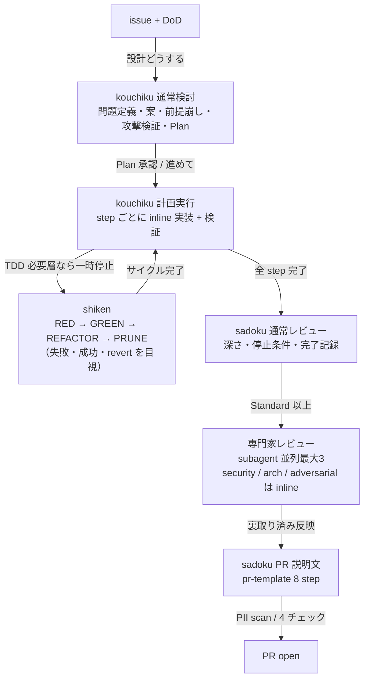
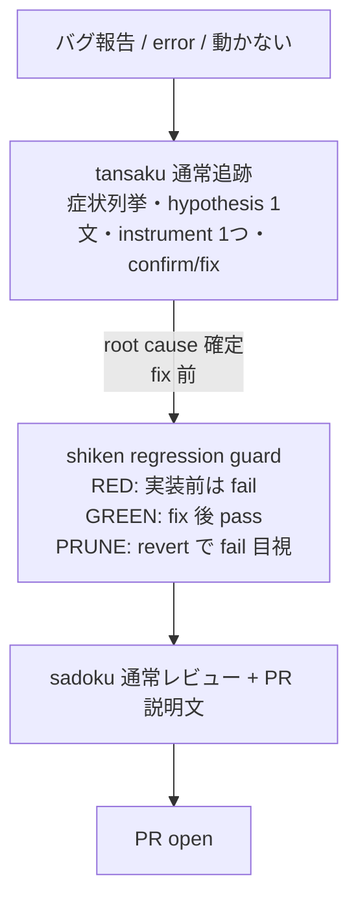
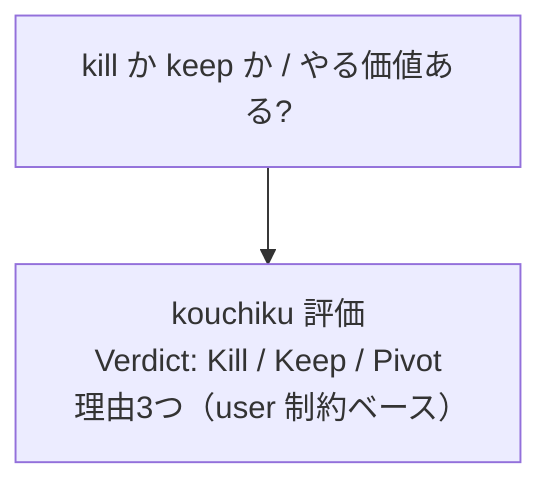
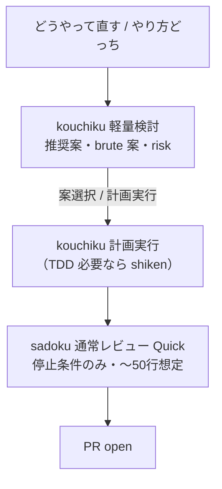
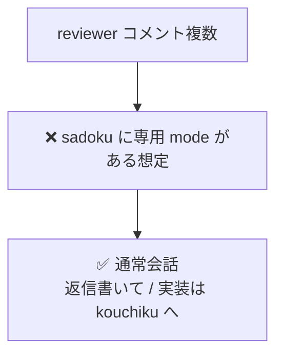
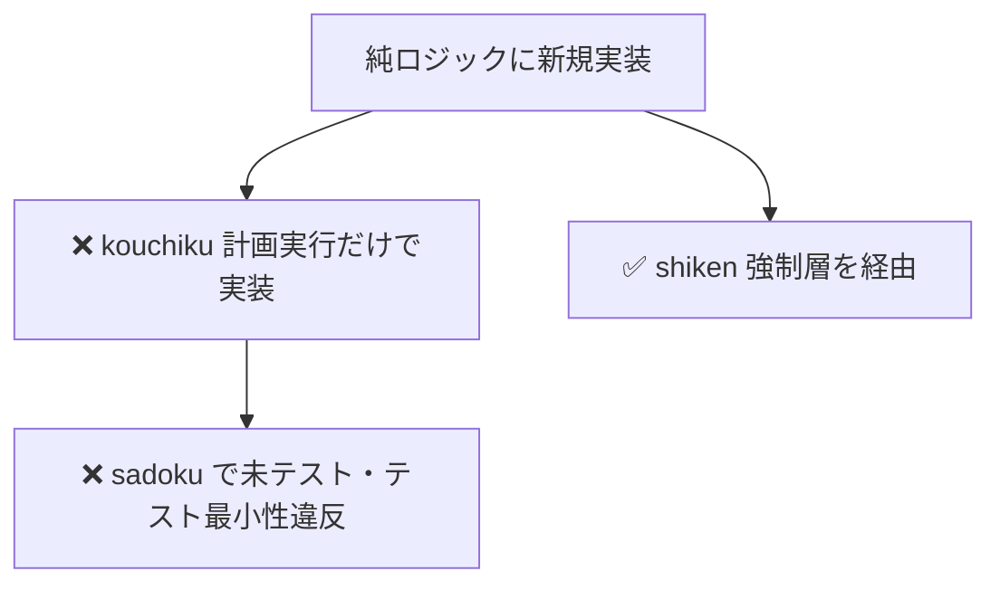
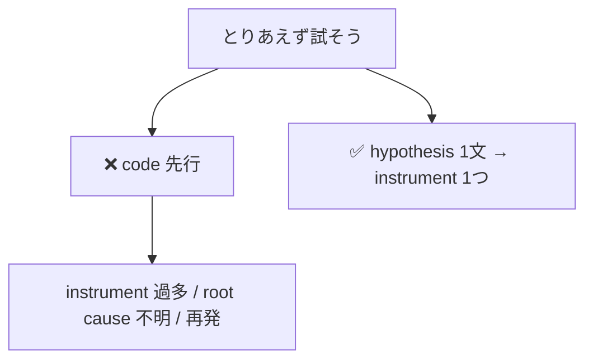

# Skill ワークフロー例

> **対象設計書:** `DESIGN.md` v3.0  
> **目的:** 「ユーザーがこう書くと、skill がこう振る舞う」を視覚的に追いやすくする。

---

## 目次

1. [役割境界](#1-役割境界)
2. [典型ワークフロー A: 新機能実装](#2-典型ワークフロー-a-新機能実装)
3. [典型ワークフロー B: バグ修正](#3-典型ワークフロー-b-バグ修正)
4. [典型ワークフロー C: 設計判断のみ](#4-典型ワークフロー-c-設計判断のみ)
5. [典型ワークフロー D: 小さい修正](#5-典型ワークフロー-d-小さい修正-軽量検討)
6. [各 skill のモード切替](#6-各-skill-のモード切替フロー)
7. [skill 間 handoff 表](#7-skill-間-handoff-表)
8. [NG パターン](#8-ng-パターンやらないことの図解)
9. [検証ログ要件](#9-各-skill-の検証ログ要件環境変化評価)
10. [参照](#10-参照)

---

## 1. 役割境界

動詞単位で 4 分割。skill 間の主な流れは下図。



### skill 一覧

| skill    | 漢字 | 動詞       | 担当                                       |
| -------- | ---- | ---------- | ------------------------------------------ |
| sadoku   | 査読 | 見る・書く | code review / PR 説明文                  |
| kouchiku | 構築 | 考える・作る | 設計判断 / 評価 / 計画策定 / 計画実行   |
| tansaku  | 探索 | 追う       | バグ調査 / root cause investigation       |
| shiken   | 試験 | 試す       | TDD discipline / PRUNE                     |

---

## 2. 典型ワークフロー A: 新機能実装

issue 受領から PR 出荷まで。**kouchiku** が「考える」から「作る」までを一気通貫。



> **ポイント**
>
> - **kouchiku → shiken → kouchiku** の往復は同セッションで起こりうる。
> - **sadoku** は実装完了後に初めて起動（「見る」専門）。
> - **専門家レビュー**は Standard 以上のみ。Quick は停止条件中心。

<details>
<summary>ASCII 版（コピー用）</summary>

```
                    ┌──────────────────┐
                    │     kouchiku     │
                    │       構築        │
                    └────┬─────────┬───┘
                         │         │
                  TDD 必要層     実装完了
                         ▼         ▼
                  ┌──────────┐  ┌──────────────┐
                  │  shiken  │  │    sadoku    │
                  └──────────┘  └──────────────┘
                  ┌──────────┐
                  │ tansaku  │
                  └──────────┘
```

</details>

---

## 3. 典型ワークフロー B: バグ修正

バグ報告から **regression guard** 付き PR まで。



> **ポイント**
>
> - **tansaku**: hypothesis を 1 文にできるまでコードに触らない discipline。
> - **bugfix** は shiken の**強制**層。再現テストを先行。
> - 「直りました」だけは不可。**fix 前後の挙動差分をそのまま引用**。

---

## 4. 典型ワークフロー C: 設計判断のみ

判断要求 → verdict。**コードは触らない。**



| ルール                         | 内容                                       |
| ------------------------------ | ------------------------------------------ |
| 「保留」は出さない             | 判断回避にならないようにする               |
| 技術的好みだけで決めない       | user 制約を根拠に含める                    |

---

## 5. 典型ワークフロー D: 小さい修正（軽量検討）

**変更対象が概ね 3 ファイル未満**の即決パターン。



---

## 6. 各 skill のモード切替フロー

### sadoku

| 種類           | trigger の例                                           | 遷移先           |
| -------------- | ------------------------------------------------------ | ---------------- |
| ユーザー発話   | 「レビューして」「コードレビュー」                     | 通常レビュー     |
| ユーザー発話   | 「PR文書いて」「PR description」                     | PR 説明文        |
| 状態           | git diff 検出 → 「レビューしますか?」                  | 通常レビュー     |
| 状態           | PR open 直前                                         | 確認 prompt      |

> reviewer コメント対応は **skill のモードにしない**。通常会話で「返信書いて」と頼む形。

### kouchiku

| trigger の例                                               | 遷移先     |
| ---------------------------------------------------------- | ---------- |
| 「どうやって直す」「やり方どっち」                         | 軽量検討   |
| 「設計どうする」「方針決めたい」「アーキテクチャ判断」     | 通常検討   |
| 「やる価値ある」「採用すべきか」「kill か keep」「やめる?」 | 評価       |
| 「計画実行」「進めて」「着手」「実装開始」（承認直後）     | 計画実行   |

### tansaku

| trigger の例                                       | 遷移先     |
| -------------------------------------------------- | ---------- |
| 「エラー」「動かない」「落ちる」「クラッシュ」     | 通常追跡   |
| 「前は動いてた」「アップデート後」「更新後動かない」 | 二分探索   |
| 「同じ問題が再発」                                 | 再発追跡   |
| 「good」screenshot 添付                            | 再発追跡   |

### shiken

| trigger の例                         | 遷移先   |
| ------------------------------------ | -------- |
| 「TDDで」「テストから書いて」        | 起動     |
| 純ロジック / API / バグ修正に触れる  | **強制** |
| インタラクションに触れる             | 推奨     |
| 純スタイル / アニメ / 文言のみ       | スキップ可（理由必須） |

---

## 7. skill 間 handoff 表

| from                 | to                     | きっかけ                    | 何を渡す              |
| -------------------- | ---------------------- | --------------------------- | --------------------- |
| (user)               | kouchiku 通常検討      | 「設計どうする」            | issue + DoD           |
| (user)               | kouchiku 軽量検討      | 「どうやって直す」          | 修正対象              |
| (user)               | kouchiku 評価          | 「やる価値ある」            | 判断対象              |
| kouchiku 通常検討    | kouchiku 計画実行      | 「計画実行」「進めて」      | Plan steps            |
| kouchiku 計画実行    | shiken                 | TDD 必要層に触れた          | レイヤー判定 + コード |
| shiken               | kouchiku 計画実行      | サイクル完了              | green 状態のコード    |
| kouchiku 計画実行    | sadoku 通常レビュー    | 実装完了                    | 完成 diff             |
| (user)               | sadoku 通常レビュー    | 「レビューして」            | diff                  |
| sadoku 通常レビュー  | subagent (reviewer-*)  | gate (b)                    | diff + 範囲           |
| subagent             | sadoku                 | 評価完了                    | findings（要裏取り）  |
| sadoku 通常レビュー  | sadoku PR 説明文       | 「PR文書いて」              | レビュー済 diff + scope |
| (user)               | tansaku                | 「エラー」「動かない」      | バグ症状              |
| tansaku              | shiken                 | bugfix 確定                 | regression guard 要件 |

---

## 8. NG パターン（やらないことの図解）

### NG-1: 廃止された「レビュー咀嚼モード」を skill で済ませる



### NG-2: TDD レイヤーを素通り



### NG-3: hypothesis なしで tansaku



---

## 9. 各 skill の検証ログ要件（環境変化評価）

| skill    | 検証ログ必須項目                                         | 形式                    |
| -------- | -------------------------------------------------------- | ----------------------- |
| sadoku   | 停止条件 scan / tests / verification / PII scan        | command + 出力末尾      |
| kouchiku | （計画実行モードのみ）verification                       | command + 出力末尾      |
| tansaku  | Confirmed（fix 前後の挙動差分）/ Tests                   | そのまま引用            |
| shiken   | RED / GREEN / PRUNE 各 phase                             | test runner 最終行      |

**禁止:** self-report だけ（「pass しました」「直りました」等）。**必ず command 実行結果を引用**。

---

## 10. 参照

| 種別     | パス |
| -------- | ---- |
| 設計本体 | [`DESIGN.md`](./DESIGN.md) |
| sadoku   | `../skills/sadoku/SKILL.md` |
| PR テンプレ | `../skills/sadoku/references/pr-template.md` |
| persona  | `../skills/sadoku/references/persona-catalog.md` |
| 文脈抽出 | `../skills/sadoku/references/project-context.md` |
| subagent | `../skills/sadoku/references/agents/reviewer-security.md`, `reviewer-architecture.md` |
| kouchiku | `../skills/kouchiku/SKILL.md` |
| tansaku  | `../skills/tansaku/SKILL.md`, `../skills/tansaku/references/logging-techniques.md` |
| shiken   | `../skills/shiken/SKILL.md`, `../skills/shiken/references/testing-anti-patterns.md` |

---

*Cursor のプレビューで Mermaid が描画されない場合は、拡張機能「Markdown Preview Mermaid Support」等の利用を検討してください。*
